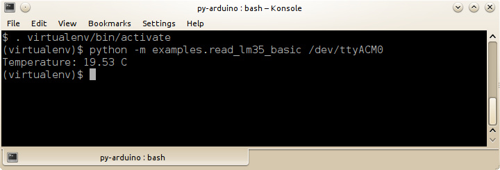

## Sensing temperature with LM35

### What you need

 - Arduino + py-arduino
 - LM35
 - wires

### How to run the example

##### Go to py-arduino directory and activate the virtualenv

    ~/$  cd py-arduino
    ~/py-arduino$  . virtualenv/bin/activate

##### Launch the example:

    ~/py-arduino$ python -m examples.read_lm35_basic /dev/ttyACM0

##### Code:


from py_arduino.main_utils import BaseMain

PIN = 0

class Main(BaseMain):

    def run(self, options, args, arduino):
        value = arduino.analogRead(PIN)
        temp = (5.0 * value * 100.0) / 1024.0
        print("Temperature: {0:3.2f} C").format(temp)

if __name__ == '__main__':
    Main().start()


